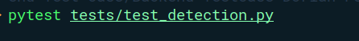

# **Table Detection Project**

This project is designed to detect tables in various types of documents, including images and PDFs. It supports different input formats such as JPEG, PNG, and PDF files. The system can process both good-quality images and corrupt or invalid files, with several test scenarios designed to verify its functionality.

## **Project Structure**

The project is structured as follows:

## **Features**

 * Table Detection: Detects tables in various documents (images, PDFs, etc.).

 * Corrupted File Handling: The system can identify and handle corrupted or invalid files gracefully.

 * Threshold Testing: Tests to check the behavior of the system under different image thresholds.

 * Unit Testing: Includes unit tests to validate the detection process.

 * Various Image Formats: The system supports multiple image formats like PNG, JPEG, and documents like PDFs.

 * Error Handling: The program handles empty, corrupted, and invalid files appropriately.

## **Usage**

### **Running the Table Detection**

To run the table detection for a specific file, execute the main.py file with the following command:

This will process the given file, and the results will be output accordingly.

### **Running Tests**

To run the unit tests for the project, use pytest:

or for unit tests:

## **File Descriptions**

 * assets/dataset: Contains various bank documents and invoices images used for testing. This includes good images, corrupted files, blank images, invalid files.

 * src/table_detector.py: The core logic for detecting tables in documents.

 * tests/test_detection.py: Contains tests for the table detection functionality.

 * tests/test_unit_detection.py: Unit tests for specific table detection features.